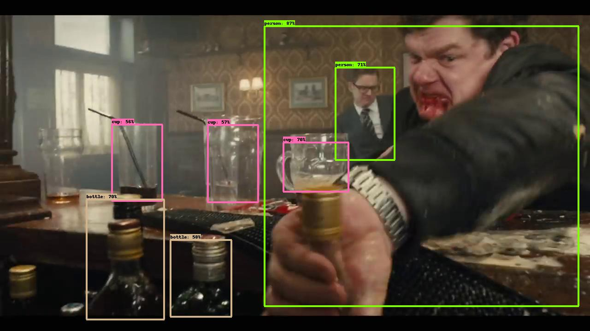

# Seq_nms_YOLO

---

## Introduction

 

This project combines **YOLOv2**([reference](https://arxiv.org/abs/1506.02640)) and **seq-nms**([reference](https://arxiv.org/abs/1602.08465)) to create **real time video detection**.

## Steps
### Previous steps
#### Option 1 script
1. Run the prepare_env.sh script, if you do not want to use a conda environment please remove the first two lines where we define the conda environment. 

#### Option 2 step by step.
1. install opencv
1. install cudatoolkit compatible with your gpu driver, this project was compiled with cudatoolkit10.1 and python 3.7
1. install scipy matplotlib tensorflow imageio and numpy
1. add your cuda bin path to the PATH variable
1. add your cuda lib64 path to the  LD_LIBRARY_PATH and LIBRARY_PATH variables

### Compilation
1. make

### Download weights
1. Download yolo.weights with the command:
	wget https://pjreddie.com/media/files/yolo.weights
1. Download tiny-yolo.weights by running:
	wget https://pjreddie.com/media/files/yolov2-tiny.weights

### Usage
1. Copy a video file to the video folder <input>
1. In the video folder, run: 
	python video2img.py -i <input>
	python get_pkllist.py
1. In the root floder and run:
	python yolo_seqnms.py
Which will create the detections in the folder video/output

1. If you want to reconstruct a video from these output images, you can go to the video folder and run: 
	python img2video.py -i output

This last command will create an output video file in video/output folder.

## Reference
This project is a copy from [yolo_seqnms](https://github.com/melodiepupu/seq_nms_yolo) 
which copied lots of code from [darknet](https://github.com/pjreddie/darknet) , [Seq-NMS](https://github.com/lrghust/Seq-NMS) and  [models](https://github.com/tensorflow/models).
